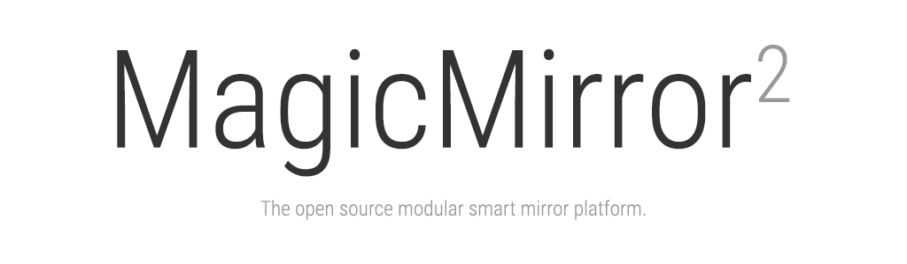

	
	
	
	
	
	

**MagicMirror²** is an open source modular smart mirror platform. With a growing list of installable modules, the **MagicMirror²** allows you to convert your hallway or bathroom mirror into your personal assistant. **MagicMirror²** is built by the creator of [the original MagicMirror](http://michaelteeuw.nl/tagged/magicmirror) with the incredible help of a [growing community of contributors](https://github.com/MichMich/MagicMirror/graphs/contributors).

MagicMirror² focuses on a modular plugin system and uses [Electron](http://electron.atom.io/) as an application wrapper. So no more web server or browser installs necessary!

## Documentation
For the full documentation including **[installation instructions](https://docs.magicmirror.builders/getting-started/installation.html)**, please visit our dedicated documentation website: [https://docs.magicmirror.builders](https://docs.magicmirror.builders).

## Links
- Website: [https://magicmirror.builders](https://magicmirror.builders)
- Documentation: [https://docs.magicmirror.builders](https://docs.magicmirror.builders)
- Forum: [https://forum.magicmirror.builders](https://forum.magicmirror.builders)
- Discord: [https://discord.gg/J5BAtvx](https://discord.gg/J5BAtvx)
- Blog: [https://michaelteeuw.nl/tagged/magicmirror](https://michaelteeuw.nl/tagged/magicmirror)
- Donations: [https://magicmirror.builders/#donate](https://magicmirror.builders/#donate)

## Contributing Guidelines

Contributions of all kinds are welcome, not only in the form of code but also with regards bug reports and documentation. For the full contribution guidelines, check out: [https://docs.magicmirror.builders/getting-started/contributing.html](https://docs.magicmirror.builders/getting-started/contributing.html)

## Enjoying MagicMirror? Consider a donation!

MagicMirror² is opensource and free. That doesn't mean we don't need any money.

Please consider a donation to help us cover the ongoing costs like webservers and email services.
If we receive enough donations we might even be able to free up some working hours and spend some extra time improving the MagicMirror² core.

To donate, please follow [this](https://www.paypal.com/cgi-bin/webscr?cmd=_s-xclick&hosted_button_id=G5D8E9MR5DTD2&source=url) link.

 
	

