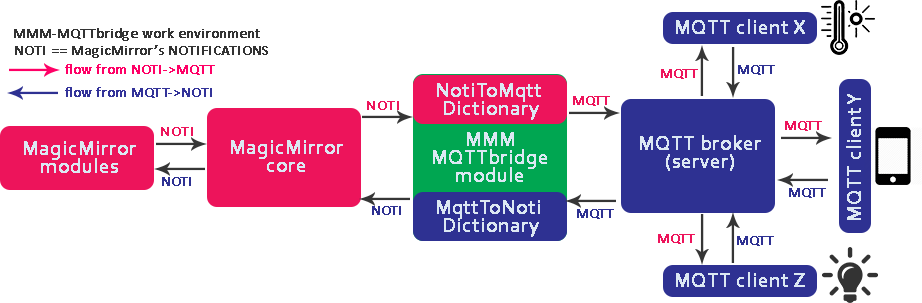

## MMM-MQTTbridge

<p align="right">
 <a href="http://choosealicense.com/licenses/mit"></a>
</p>

[**MMM-MQTTbridge**](.) allows you to integrate your MagicMirror into your smart home system via [MQTT protocol](https://github.com/mqtt/mqtt.github.io/wiki/software?id=software) and manage MagicMirror via MQTT messages by converting them into MM Notifications and vise verse - listen to your MM's Notifications and convert them into MQTT mesages.

So, this module for MagicMirror does the following:

1. **Listens to MQTT messages** from your MQTT broker and, if mqtt-message arrives, module **sends MM Notifications** based on the pre-configured mqtt-to-notification Dictionary rules.
2. **Listens to the MM Notifications** within your MagicMirror environment. If Notification arrives, module **sends MQTT message** based on the preconfigured notification-to-mqtt Dictionary rules.



## INSTALLATION

**1. Clone and install module. Do the following commands**:

```bash
cd ~/MagicMirror/modules
git clone --depth=1 https://github.com/sergge1/MMM-MQTTbridge.git
cd MMM-MQTTbridge
npm install
```

**2. Copy to MagicMirror config.js file MQTTbridge's config section**:

- go to `cd ~/MagicMirror/config`
- open file `config.js`
- add the following config within `modules` section:

```json5
{
 module: 'MMM-MQTTbridge',
 disabled: false,
 config: {
  mqttServer: "mqtt://:@localhost:1883",
  mqttConfig:
  {
   listenMqtt: true,
   interval: 300000,
  },
  notiConfig:
  {
   listenNoti: true,
   ignoreNotiId: ["CLOCK_MINUTE", "NEWS_FEED"],
   ignoreNotiSender: ["system", "NEWS_FEED"],
  },
  // set "NOTIFICATIONS -> MQTT" dictionary at /dict/notiDictionary.js
  // set "MQTT -> NOTIFICATIONS" dictionary at /dict/mqttDictionary.js
 },
},
```

If you like to use a tls encrypted connection to your server you can use this example configuration:

```json5
{
 module: 'MMM-MQTTbridge',
 disabled: false,
 config: {
  mqttServer: "mqtts://:@localhost:8883",
  mqttConfig:
  {
    listenMqtt: true,
    interval: 300000,
    mqttClientKey: "/home/pi/client-key.pem",
    mqttClientCert: "/home/pi/client-cert.pem",
    caCert: "/home/pi/ca-cert.pem",
    rejectUnauthorized: true,
  },
  notiConfig:
  {
    listenNoti: true,
    ignoreNotiId: ["CLOCK_MINUTE", "NEWS_FEED"],
    ignoreNotiSender: ["system", "NEWS_FEED"],
  },
  // set "NOTIFICATIONS -> MQTT" dictionary at /dict/notiDictionary.js
  // set "MQTT -> NOTIFICATIONS" dictionary at /dict/mqttDictionary.js
 },
},
```

**3. Set dictionary files with your MQTT->NOTI and NOTI->MQTT rules**:

- go to `cd ~/MagicMirror/modules/MMM-MQTTbridge/dict`
- copy the example files `cp notiDictionary.example.js notiDictionary.js; cp mqttDictionary.example.js mqttDictionary.js`
- edit `notiDictionary.js` and `mqttDictionary.js` for respective rules according to the explanation below.

## CONFIG STRUCTURE

**For better understanding, we have divided config into 3 sections**:

1. General configurations in `config.js`;
2. "NOTIFICATION to MQTT" dictionary rules;
3. "MQTT to NOTIFICATION" dictionary rules;

### GENERAL SECTION

- `stringifyPayload`- specify if the payload of notifications should be converted with "JSON.stringify" before it will be send as MQTT message (The setting can be overriden for each message seperatly in "notiDictionary.js"), default is true.
- `mqttDictConf`- specify the path to the "mqttDictionary.js" file starting at the module folder, default: "./dict/mqttDictionary.js"
- `notiDictConf`- specify the path to the "notiDictionary.js" file starting at the module folder, default: "./dict/notiDictionary.js"
- `newlineReplacement`- if you use `valueFormat` for MQTT messages or for notification payloads you need to configure how new line characters should be replaced. See [valueFormat.md](valueFormat.md) for further details.
- `notiConfig`- the notification configuration. See the "notiConfig part" section for details
- `mqttConfig`- the mqtt configuration. See the "mqttConfig part" section for details

#### mqttConfig part

- `mqttServer` - set you server address using the following format:   "mqtt://"+USERNAME+":"+PASSWORD+"@"+IPADDRESS+":"+PORT or "mqtts://"+USERNAME+":"+PASSWORD+"@"+IPADDRESS+":"+PORT. E.g. if you are using your broker with plaintext connnection *without username/password* on *localhost* with port *1883*, you config should looks "*mqtt://:@localhost:1883*",
- `clientId` - specify the id this client will register at the mqtt broker with, default: a random string starting with "mqttjs_"
- `mqttClientKey` - specify the path of the client tls key file (mandatory if using tls connetion). i.e. "/home/pi/client-key.pem";
- `mqttClientCert` - specify the path of the client tls certificate file (mandatory if using tls connection). i.e. "/home/pi/client-cert.pem";
- `caCert` - specify the path of the CA tls certificate file (mandatory if using tls connection). i.e. "/home/pi/ca-cert.pem";
- `rejectUnauthorized` - specify if a self-signed server certificate should be rejected, default is true;
- `listenMqtt` - turn on/off the listening of MQTT messages. Set to `false` if you are going to use only NOTI->MQTT dictionary to save CPU usage;
- `qos` - specify the default QoS level for subscribed MQTT messages (can be overriden for each message in "mqttDictionary.js"), default: 0
- `retain` - specify the default retain flag for published MQTT messages (can be overriden for each message in "mqttDictionary.js"), default: false
- `clean` - should the connection be a clean one (look [mqtt-clean-sessions-example](http://www.steves-internet-guide.com/mqtt-clean-sessions-example/) for details), default: true
- `will` - specify a object containing the "topic", "payload", etc. (see [MQTT.js](https://github.com/mqttjs/MQTT.js#readme) for details) you want the broker send to subscribing clients if the connection to this client is interrupted unexpected, default: unset
- `options` - if you want to specify additional options for the connect you can add all of the MQTT-Lib supported ones this as this options object (see [MQTT.js](https://github.com/mqttjs/MQTT.js#readme) for details). If `clientId`, `clean` and `will` are specified both as single options and in this options object the single ones override the ones in the options object, default: unset
- `interval` - interval for MQTT status update (messages will be received all time independent of this setting), default is 300000ms.
- `onConnectMessages` - a array of MQTT messages that should be send after the MQTT connected and subscribed to all topics successfully. While `topic` and `msg` setting are mandatory `options` are optional.

onConnectMessages example:

```json5
{
 module: 'MMM-MQTTbridge',
 disabled: false,
 config: {
  mqttServer: "mqtts://:@localhost:8883",
  mqttConfig:
  {
    listenMqtt: true,
    interval: 300000,
    mqttClientKey: "/home/pi/client-key.pem",
    mqttClientCert: "/home/pi/client-cert.pem",
    caCert: "/home/pi/ca-cert.pem",
    rejectUnauthorized: true,
    onConnectMessages: [
      {
        topic: "test1/connected",
        msg: "true",
        options: {
          retain: false,
          qos: 1
        }
      },
      {
        topic: "test2/get_status",
        msg: {value: "test"}
      }
    ]
  },
 },
},
```

#### notiConfig part

- `listenNoti` - turn on/off the listening of NOTIFICATIONS. Set to `false` if you are going to use only MQTT->NOTI dictionary to save CPU usage;
- `ignoreNotiId` - list your NOTIFICATION ID that should be ignored from processing, this saves CPU usage. E.g. ["CLOCK_MINUTE", "NEWS_FEED"],
- `ignoreNotiSender` - list your NOTIFICATION SENDERS that should be ignored from processing, this saves CPU usage. E.g. ["system", "NEWS_FEED"]
- `qos` - specify the default QoS level for published MQTT messages (can be overriden for each message in "notiDictionary.js"), default: 0
- `onConnectNotifications` - a array of notifications that are send after the MQTT client connected and subscribed to all topics successfully. While `notification` is mandatory `payload` is optional.

onConnectNotifications example:

```json5
{
 module: 'MMM-MQTTbridge',
 disabled: false,
 config: {
  mqttServer: "mqtts://:@localhost:8883",
  notiConfig:
  {
    listenNoti: true,
    ignoreNotiId: ["CLOCK_MINUTE", "NEWS_FEED"],
    ignoreNotiSender: ["system", "NEWS_FEED"],
    onConnectNotifications: [
      {
        notification: "TEST1",
        payload: true
      },
      {
        notification: "TEST2",
        payload: {value: "myvalue"}
      }
    ]
  },
 },
},
```

### NOTIFICATIONS to MQTT DICTIONARY SECTION

Should be set within `~/MagicMirror/modules/MMM-MQTTbridge/dict/notiDictionary.js` or the path you configured with the general configuration option `notiDictConf`.

:warning:
The configuration of how to ignore the payload value of notifications or send the payload of notifications as mqtt messages changed slightly with version 2.0 of the module!

If the `payloadValue` is missing for a `notiPayload` element all commands configured in `notiMqttCmd` will be initiated independent of the value of the notification payload (new since version 2.0 of the module)!  
If the `payloadValue` is set the payload of the notification needs to match with this value for the commands in `notiMqttCmd` to be initiated!  
A `payloadValue` set to `''` will match for notifications with no payload or with the payload set to a empty string (new with version 2.0 of the module, **DIFFERENT TO VERSIONS 1.X AND LOWER**)!  

If no `mqttMsgPayload` is specified the payload of the notification will be send as MQTT message (new since version 2.0 of the module, **DIFFERENT TO VERSIONS 1.X and LOWER**)!
If `mqttMsgPayload` is present the value of `mqttMsgPayload` will be send as MQTT message!  

You can configure if the payload of a notification should be stringified before it is send with the optional option "stringifyPayload". The default value is the one configured in the general section.

:warning:
The way boolean values as payload of notifications are treated changed with version 2.0 of the module. NO NEED TO CONVERT THEM TO 0 OR 1 ANYMORE!!!

As of version 2.0 of the module it is possible to specify `qos`, `retain` settings for each `notiMqttCommands` element. If present these settings override the default values of the general configuration.
Additionally `options` can be specified which support all options for published messages of the MQTT.js library (see [MQTT.js](https://github.com/mqttjs/MQTT.js#readme) for details). If `qos` and `retain` are specified as single values and in the `options` the single values override the `options`.

As of version 2.1 it is possible to format the payload of the notification with a `valueFormat` string before it will be compared to the `payloadValue` and will be further processed. Look at [valueFormat.md](valueFormat.md) for further details.

As of version 2.1 it is possible to define complexer `conditions` than only compare the payload content to the `payloadValue`. Look at [conditions.md](conditions.md) for further details.

```js
var notiHook = [
  {
    notiId: "CLOCK_SECOND",
    notiPayload: [
      {
        payloadValue: '10', 
        notiMqttCmd: ["Command 1"]
      },
      {
        notiMqttCmd: ["payload ignored"]
      },
      {
        payloadValue: ''
        notiMqttCmd: ["payload is empty string"]
      },
    ],
  },
  {
    notiId: "INDOOR_TEMPERATURE",
    notiPayload: [
      {
        payloadValue: '',
        notiMqttCmd: ["Command 2"]
      },
    ],
  },
  {
    notiId: "TOGGLE_SHELLY_PLUG",
    notiPayload: [
      {
        payloadValue: '', 
        notiMqttCmd: ["Command 3"]
      },
    ],
  },
];
var notiMqttCommands = [
  {
    commandId: "Command 1",
    mqttTopic: "myhome/kitchen/light/set",
    retain: true,
    qos: 2,
    mqttMsgPayload: '{"state":"OFF"}'
  },
  {
    commandId: "Command 2",
    mqttTopic: "myhome/kitchen/temperature",
    mqttMsgPayload: '',
    options: {
      retain: true,
      qos: 1
    }
  },
  {
    commandId: "Command 3",
    mqttTopic: "shellies/plug/relay/0/command",
    stringifyPayload: false,
    mqttMsgPayload: 'toogle'
  },
  {
    commandId: "payload ignored",
    mqttTopic: "myhome/plug",
    mqttMsgPayload: '{"state":"OFF"}'
  },
  {
    commandId: "payload is empty string",
    mqttTopic: "myhome/test",
    mqttMsgPayload: '{"state":"OFF"}'
  },
  {
    commandId: "payload of notification is send",
    mqttTopic: "myhome/test",
  },
];
```

### MQTT to NOTIFICATIONS DICTIONARY SECTION

Should be set within `~/MagicMirror/modules/MMM-MQTTbridge/dict/mqttDictionary.js` or the path you configured with the general configuration option `mqttDictConf`.

:warning:
The configuration of how to ignore the payload value of mqtt messages or send the payload of mqtt message as notification payload changed slightly with version 2.0 of the module!

If the `payloadValue` is missing for a `mqttPayload` element all commands configured in `mqttNotiCmd` will be initiated independent of the value of mqtt message (new since version 2.0 of the module)!  
If the `payloadValue` is set, the payload of the message needs to match with this value for the commands in `mqttNotiCmd` to be initiated!  
A `payloadValue` set to `''` will match for empty messsage (new with version 2.0 of the module, **DIFFERENT TO VERSIONS 1.X AND LOWER**)!  

If no `notiPayload` is specified the message content will be send as payload of the notification (new since version 2.0 of the module, **DIFFERENT TO VERSIONS 1.X and LOWER**)!
If `notiPayload` is present the value of `notiPayload` will be send as MQTT message!  

As of version 2.0 of the module it is possible to specify `qos` setting for each `mqttHook` element. If present these settings override the default values of the general configuration.
Additionally `options` can be specified which support all options for subscribing to messages of the MQTT.js library (see [MQTT.js](https://github.com/mqttjs/MQTT.js#readme) for details). If `qos` is specified as single value and in the `options` the single value override the `options`.

As of Version 2.1 it is possible to let the message value be parsed as JSON and select single or multiple values with [JSONPath-Plus](https://github.com/JSONPath-Plus/JSONPath) before the message gets further processed. Look at [jsonpath.md](jsonpath.md) for further details.

As of version 2.1 it is possible to format the message or [JSONPath-Plus](https://github.com/JSONPath-Plus/JSONPath) result with a `valueFormat` string before it will be compared to the `payloadValue` and will be further processed. Look at [valueFormat.md](valueFormat.md) for further details.

As of version 2.1 it is possible to define complexer `conditions` than only compare the messaage content to the `payloadValue`. Look at [conditions.md](conditions.md) for further details.

```js
var mqttHook = [
    {
      mqttTopic: "myhome/test",
      qos: 1,
      mqttPayload: [
        {
          payloadValue: "ASSISTANT_LISTEN",
          mqttNotiCmd: ["Command 1"]
        },
        {
          payloadValue: "",
          mqttNotiCmd: ["Command 2"]
        },
      ],
    },
    {
      mqttTopic: "myhome/test2",
      mqttPayload: [
        {
          mqttNotiCmd: ["Command 2"]
        },
      ],
    },
    {
      mqttTopic: "myhome/test3",
      options: {
        qos: 2
      }
      mqttPayload: [
        {
          payloadValue: "",
          mqttNotiCmd: ["Command 2"]
        },
      ],
    },
    {
      mqttTopic: "myhome/testjson",
      mqttPayload: [
        {
          jsonpath: "output"
          valueFormat: "Number(${value}).toFixed(2)",
          mqttNotiCmd: ["Command 3"],
          conditions: [
            {
              type: "gt",
              value: "10"
            },
            {
              type: "lt",
              value: "15"
            }
          ]
        },
      ],
    },
  ];
var mqttNotiCommands = [
    {
      commandId: "Command 1",
      notiID: "ASSISTANT_LISTEN",
      notiPayload: 'BLABLABLA-1'
    },
    {
      commandId: "Command 2",
      notiID: "ASSISTANT_LISTEN",
    },
    {
      commandId: "Command 3",
      notiID: "PARSED_JSON_NOTIFICATION",
    },
  ];
  ```
  
## CREDITS

[@bugsounet](https://github.com/bugsounet)

[@sergge1](https://github.com/sergge1)

[@DanielHfnr](https://github.com/DanielHfnr)
