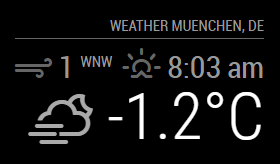
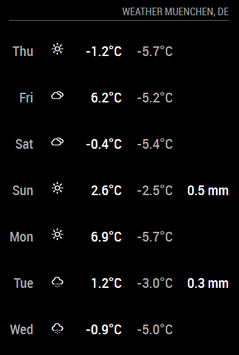

# Weather Module

This module is aimed to be the replacement for the current `currentweather` and `weatherforcast` modules. The module will be configurable to be used as a current weather view, or to show the forecast. This way the module can be used twice to fullfil both purposes.

The biggest change is the use of weather providers. This way we are not bound to one API source. And users can choose which API they want to use as their source.

The module is in a very early stage, and needs a lot of work. It's API isn't set in stone, so keep that in mind when you want to contribute.

## Example

 

## Usage

To use this module, add it to the modules array in the `config/config.js` file:

````javascript
modules: [
	{
		module: "weather",
		position: "top_right",
		config: {
			// See 'Configuration options' for more information.
			type: 'current'
		}
	}
]
````

## Configuration options

The following properties can be configured:

### General options

| Option                       | Description
| ---------------------------- | -----------
| `weatherProvider`            | Which weather provider should be used. <br><br> **Possible values:** `openweathermap` , `darksky` , `weathergov` or `ukmetoffice`<br> **Default value:** `openweathermap`
| `type`                       | Which type of weather data should be displayed. <br><br> **Possible values:** `current` or `forecast` <br> **Default value:** `current`
| `units`                      | What units to use. Specified by config.js <br><br> **Possible values:** `config.units` = Specified by config.js, `default` = Kelvin, `metric` = Celsius, `imperial` = Fahrenheit <br> **Default value:** `config.units`
| `tempUnits`                  | What units to use for temperature. If specified overrides `units` setting. Specified by config.js <br><br> **Possible values:** `config.units` = Specified by config.js, `default` = Kelvin, `metric` = Celsius, `imperial` = Fahrenheit <br> **Default value:** `units`
| `windUnits`                  | What units to use for wind speed.  If specified overrides `units` setting. Specified by config.js <br><br> **Possible values:** `config.units` = Specified by config.js, `default` = Kelvin, `metric` = Celsius, `imperial` = Fahrenheit <br> **Default value:** `units`
| `roundTemp`                  | Round temperature value to nearest integer. <br><br> **Possible values:** `true` (round to integer) or `false` (display exact value with decimal point) <br> **Default value:** `false`
| `degreeLabel`                | Show the degree label for your chosen units (Metric = C, Imperial = F, Kelvin = K). <br><br> **Possible values:** `true` or `false` <br> **Default value:** `false`
| `updateInterval`             | How often does the content needs to be fetched? (Milliseconds) <br><br> **Possible values:** `1000` - `86400000` <br> **Default value:** `600000` (10 minutes)
| `animationSpeed`             | Speed of the update animation. (Milliseconds) <br><br> **Possible values:** `0` - `5000` <br> **Default value:** `1000` (1 second)
| `timeFormat`                 | Use 12 or 24 hour format. <br><br> **Possible values:** `12` or `24` <br> **Default value:** uses value of _config.timeFormat_
| `showPeriod`                 | Show the period (am/pm) with 12 hour format <br><br> **Possible values:** `true` or `false` <br> **Default value:** `true`
| `showPeriodUpper`	           | Show the period (AM/PM) with 12 hour format as uppercase <br><br> **Possible values:** `true` or `false` <br> **Default value:** `false`
| `lang`                       | The language of the days. <br><br> **Possible values:** `en`, `nl`, `ru`, etc ... <br> **Default value:** uses value of _config.language_
| `decimalSymbol`              | The decimal symbol to use.<br><br> **Possible values:** `.`, `,` or any other symbol.<br> **Default value:** `.`
| `initialLoadDelay`           | The initial delay before loading. If you have multiple modules that use the same API key, you might want to delay one of the requests. (Milliseconds) <br><br> **Possible values:** `1000` - `5000` <br> **Default value:** `0`
| `appendLocationNameToHeader` | If set to `true`, the returned location name will be appended to the header of the module, if the header is enabled. This is mainly interesting when using calender based weather. <br><br> **Default value:** `true`
| `calendarClass`              | The class for the calender module to base the event based weather information on. <br><br> **Default value:** `'calendar'`

#### Current weather options

| Option                       | Description
| ---------------------------- | -----------
| `onlyTemp`                   | Show only current Temperature and weather icon without windspeed, sunset, sunrise time and feels like. <br><br> **Possible values:** `true` or `false` <br> **Default value:** `false`
| `useBeaufort`                | Pick between using the Beaufort scale for wind speed or using the default units. <br><br> **Possible values:** `true` or `false` <br> **Default value:** `true`
| `showWindDirection`          | Show the wind direction next to the wind speed. <br><br> **Possible values:** `true` or `false` <br> **Default value:** `true`
| `showWindDirectionAsArrow`   | Show the wind direction as an arrow instead of abbreviation <br><br> **Possible values:** `true` or `false` <br> **Default value:** `false`
| `showHumidity`               | Show the current humidity <br><br> **Possible values:** `true` or `false` <br> **Default value:** `false`
| `showIndoorTemperature`      | If you have another module that emits the `INDOOR_TEMPERATURE` notification, the indoor temperature will be displayed <br> **Default value:** `false`
| `showIndoorHumidity`         | If you have another module that emits the `INDOOR_HUMIDITY` notification, the indoor humidity will be displayed <br> **Default value:** `false`
| `showFeelsLike`              | Shows the Feels like temperature weather. <br><br> **Possible values:** `true` or `false`<br>**Default value:** `true`

#### Weather forecast options

| Option                       | Description
| ---------------------------- | -----------
| `tableClass`                 | The class for the forecast table. <br><br> **Default value:** `'small'`
| `colored`                    | If set to `true`, the min and max temperature are color coded. <br><br> **Default value:** `false`
| `showPrecipitationAmount`    | Show the amount of rain/snow in the forecast <br><br> **Possible values:** `true` or `false` <br> **Default value:** `false`
| `fade`                       | Fade the future events to black. (Gradient) <br><br> **Possible values:** `true` or `false` <br> **Default value:** `true`
| `fadePoint`                  | Where to start fade? <br><br> **Possible values:** `0` (top of the list) - `1` (bottom of list) <br> **Default value:** `0.25`
| `maxNumberOfDays`            | How many days of forecast to return. Specified by config.js <br><br> **Possible values:** `1` - `16` <br> **Default value:** `5` (5 days) <br> This value is optional. By default the weatherforecast module will return 5 days.

### Openweathermap options

| Option                       | Description
| ---------------------------- | -----------
| `apiVersion`                 | The OpenWeatherMap API version to use. <br><br> **Default value:** `2.5`
| `apiBase`                    | The OpenWeatherMap base URL. <br><br> **Default value:** `'http://api.openweathermap.org/data/'`
| `weatherEndpoint`	           | The OpenWeatherMap API endPoint. <br><br> **Possible values:** `/weather`, `/forecast` (free users) or `/forecast/daily` (paying users or old apiKey only) <br> **Default value:** `'/weather'`
| `locationID`                 | Location ID from [OpenWeatherMap](https://openweathermap.org/find) **This will override anything you put in location.** <br> Leave blank if you want to use location. <br> **Example:** `1234567` <br> **Default value:** `false` <br><br> **Note:** When the `location` and `locationID` are both not set, the location will be based on the information provided by the calendar module. The first upcoming event with location data will be used.
| `location`                   | The location used for weather information. <br><br> **Example:** `'Amsterdam,Netherlands'` <br> **Default value:** `false` <br><br> **Note:** When the `location` and `locationID` are both not set, the location will be based on the information provided by the calendar module. The first upcoming event with location data will be used.
| `apiKey`                     | The [OpenWeatherMap](https://home.openweathermap.org) API key, which can be obtained by creating an OpenWeatherMap account. <br><br> This value is **REQUIRED**

### Darksky options

| Option                       | Description
| ---------------------------- | -----------
| `apiBase`                    | The DarkSky base URL. The darksky api has disabled [cors](https://developer.mozilla.org/en-US/docs/Web/HTTP/CORS), therefore a proxy is required. <br><br> **Possible value:** `'https://cors-anywhere.herokuapp.com/https://api.darksky.net'` <br> This value is **REQUIRED**
| `weatherEndpoint`	           | The DarkSky API endPoint. <br><br> **Possible values:** `/forecast` <br> This value is **REQUIRED**
| `apiKey`                     | The [DarkSky](https://darksky.net/dev/register) API key, which can be obtained by creating an DarkSky account. <br><br> This value is **REQUIRED**
| `lat`                        | The geo coordinate latitude. <br><br> This value is **REQUIRED**
| `lon`                        | The geo coordinate longitude. <br><br> This value is **REQUIRED**

### Weather.gov options

| Option                       | Description
| ---------------------------- | -----------
| `apiBase`                    | The weather.gov base URL. <br><br> **Possible value:** `'https://api.weather.gov/points/'` <br> This value is **REQUIRED**
| `weatherEndpoint`	           | The weather.gov API endPoint. <br><br> **Possible values:** `/forecast` for forecast and `/forecast/hourly` for current. <br> This value is **REQUIRED**
| `lat`                        | The geo coordinate latitude. <br><br> This value is **REQUIRED**
| `lon`                        | The geo coordinate longitude. <br><br> This value is **REQUIRED**

### UK Met Office options

| Option                       | Description
| ---------------------------- | -----------
| `apiBase`                    | The UKMO base URL. <br><br> **Possible value:**  `'http://datapoint.metoffice.gov.uk/public/data/val/wxfcs/all/json/'` <br>  This value is **REQUIRED**
| `locationId`	               | The UKMO API location code. <br><br> **Possible values:** `322942` <br>  This value is **REQUIRED**
| `apiKey`                     | The [UK Met Office](https://www.metoffice.gov.uk/datapoint/getting-started) API key, which can be obtained by creating an UKMO Datapoint account. <br><br>  This value is **REQUIRED**

## API Provider Development

If you want to add another API provider checkout the [Guide](providers).
