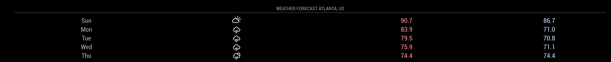

# Module: Weather Forecast
The `weatherforecast` module is one of the default modules of the MagicMirror.
This module displays the weather forecast for the coming week, including an an icon to display the current conditions, the minimum temperature and the maximum temperature.

## Screenshots

- 5 day forecast


## Using the module

To use this module, add it to the modules array in the `config/config.js` file:
````javascript
modules: [
	{
		module: "weatherforecast",
		position: "top_right",	// This can be any of the regions.
									// Best results in left or right regions.
		config: {
			// See 'Configuration options' for more information.
			location: "Amsterdam,Netherlands",
			locationID: "", //Location ID from http://bulk.openweathermap.org/sample/city.list.json.gz
			appid: "abcde12345abcde12345abcde12345ab" //openweathermap.org API key.
		}
	}
]
````

## Configuration options

The following properties can be configured:

| Option                       | Description
| ---------------------------- | -----------
| `location`                   | The location used for weather information. <br><br> **Example:** `'Amsterdam,Netherlands'` <br> **Default value:** `false` <br><br> **Note:** When the `location` and `locationID` are both not set, the location will be based on the information provided by the calendar module. The first upcoming event with location data will be used.
| `locationID`                 | Location ID from [OpenWeatherMap](https://openweathermap.org/find) **This will override anything you put in location.** <br> Leave blank if you want to use location. <br> **Example:** `1234567` <br> **Default value:** `false` <br><br> **Note:** When the `location` and `locationID` are both not set, the location will be based on the information provided by the calendar module. The first upcoming event with location data will be used.
| `appid`                      | The [OpenWeatherMap](https://home.openweathermap.org) API key, which can be obtained by creating an OpenWeatherMap account. <br><br> This value is **REQUIRED**
| `units`                      | What units to use. Specified by config.js <br><br> **Possible values:** `config.units` = Specified by config.js, `default` = Kelvin, `metric` = Celsius, `imperial` =Fahrenheit <br> **Default value:** `config.units`
| `roundTemp`                  | Round temperature values to nearest integer. <br><br> **Possible values:** `true` (round to integer) or `false` (display exact value with decimal point) <br> **Default value:** `false`
| `maxNumberOfDays`            | How many days of forecast to return. Specified by config.js <br><br> **Possible values:** `1` - `16` <br> **Default value:** `7` (7 days) <br> This value is optional. By default the weatherforecast module will return 7 days.
| `showRainAmount`             | Should the predicted rain amount be displayed? <br><br> **Possible values:** `true` or `false` <br> **Default value:** `false` <br> This value is optional. By default the weatherforecast module will not display the predicted amount of rain.
| `updateInterval`             | How often does the content needs to be fetched? (Milliseconds) <br><br> **Possible values:** `1000` - `86400000` <br> **Default value:** `600000` (10 minutes)
| `animationSpeed`             | Speed of the update animation. (Milliseconds) <br><br> **Possible values:** `0` - `5000` <br> **Default value:** `1000` (1 second)
| `lang`                       | The language of the days. <br><br> **Possible values:** `en`, `nl`, `ru`, etc ... <br> **Default value:** uses value of _config.language_
| `decimalSymbol`              | The decimal symbol to use.<br><br> **Possible values:** `.`, `,` or any other symbol.<br> **Default value:** `.`
| `fade`                       | Fade the future events to black. (Gradient) <br><br> **Possible values:** `true` or `false` <br> **Default value:** `true`
| `fadePoint`                  | Where to start fade? <br><br> **Possible values:** `0` (top of the list) - `1` (bottom of list) <br> **Default value:** `0.25`
| `initialLoadDelay`           | The initial delay before loading. If you have multiple modules that use the same API key, you might want to delay one of the requests. (Milliseconds) <br><br> **Possible values:** `1000` - `5000` <br> **Default value:**  `2500` (2.5 seconds delay. This delay is used to keep the OpenWeather API happy.)
| `retryDelay`                 | The delay before retrying after a request failure. (Milliseconds) <br><br> **Possible values:** `1000` - `60000` <br> **Default value:**  `2500`
| `apiVersion`                 | The OpenWeatherMap API version to use. <br><br> **Default value:**  `2.5`
| `apiBase`                    | The OpenWeatherMap base URL. <br><br> **Default value:**  `'http://api.openweathermap.org/data/'`
| `forecastEndpoint`           | The OpenWeatherMap API endPoint. <br><br> **Default value:**  `'forecast/daily'`
| `appendLocationNameToHeader` | If set to `true`, the returned location name will be appended to the header of the module, if the header is enabled. This is mainly intresting when using calender based weather. <br><br> **Default value:**  `true`
| `calendarClass`              | The class for the calendar module to base the event based weather information on. <br><br> **Default value:** `'calendar'`
| `tableClass`                  | Name of the classes issued from `main.css`. <br><br> **Possible values:** xsmall, small, medium, large, xlarge. <br> **Default value:** _small._
| `iconTable`                  | The conversion table to convert the weather conditions to weather-icons. <br><br> **Default value:** view table below
| `colored`                    | If set `colored` to `true` the min-temp gets a blue tone and the max-temp gets a red tone. <br><br> **Default value:** `'false'`
| `scale  `                    | If set to `true` the module will display `C` for Celsius degrees and `F` for Fahrenheit degrees after the number, based on the value of the `units` option, otherwise only the &deg; character is displayed. <br><br> **Default value:** `false`

#### Default Icon Table
````javascript
iconTable: {
    '01d': 'wi-day-sunny',
    '02d': 'wi-day-cloudy',
    '03d': 'wi-cloudy',
    '04d': 'wi-cloudy-windy',
    '09d': 'wi-showers',
    '10d': 'wi-rain',
    '11d': 'wi-thunderstorm',
    '13d': 'wi-snow',
    '50d': 'wi-fog',
    '01n': 'wi-night-clear',
    '02n': 'wi-night-cloudy',
    '03n': 'wi-night-cloudy',
    '04n': 'wi-night-cloudy',
    '09n': 'wi-night-showers',
    '10n': 'wi-night-rain',
    '11n': 'wi-night-thunderstorm',
    '13n': 'wi-night-snow',
    '50n': 'wi-night-alt-cloudy-windy'
}
````
